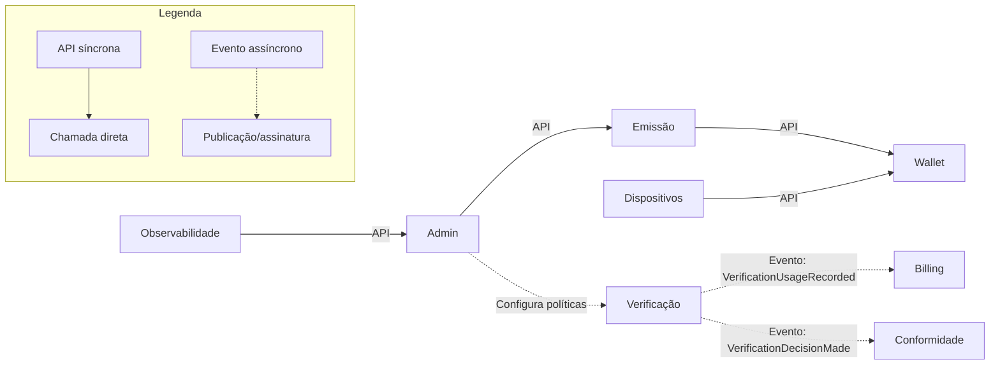
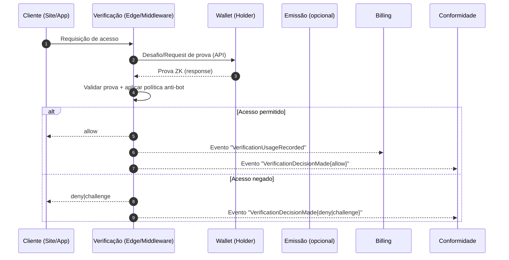
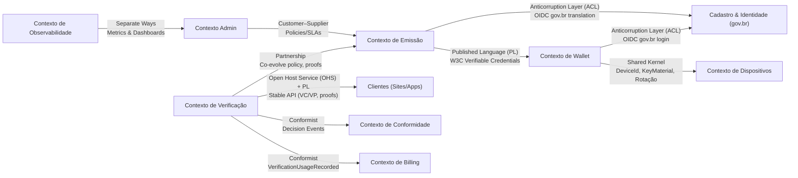
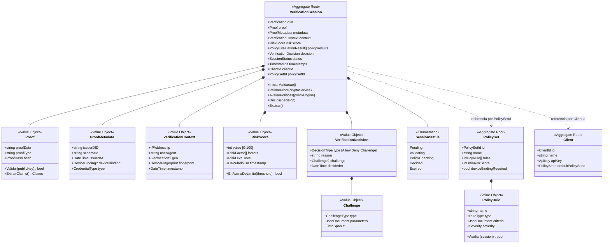

# Dinâmica: Design Estratégico do Projeto

## Objetivo
Identificar os subdomínios do projeto, classificá-los (Core, Supporting, Generic) e desenhar os bounded contexts, incluindo suas interações. Esse exercício ajudará a criar uma visão clara e estratégica do domínio.

---

## 1. Nome do Projeto
**Não Sou Robô (HumanoID)**

---

## 2. Objetivo Principal do Projeto
**Emitir e verificar credenciais verificáveis vinculadas ao CPF/CIN, permitindo provas ZK no dispositivo para validar “humano real” e bloquear robôs em sites e aplicativos.**

---

## 3. Identificação dos Subdomínios

| **Subdomínio**              | **Descrição**                                                                                      | **Tipo**         |
|-----------------------------|--------------------------------------------------------------------------------------------------|------------------|
| Emissão de Credenciais (Issuer) | Fluxo de emissão de VCs vinculadas ao CPF/CIN, com regras de emissão e revogação.             | Core Domain      |
| Verificação & Anti-Bot (Verifier) | Middleware/edge para validação de provas ZK e bloqueio de acessos automatizados.           | Core Domain      |
| Wallet & Provas ZK          | Criação/recuperação de identidade (DID), gestão de VCs e geração de proofs ZK.                   | Core Domain      |
| Cadastro & Identidade (gov.br) | Autenticação via gov.br e vinculação com CPF/CIN.                                              | Supporting       |
| Gestão de Dispositivos      | Vínculo da credencial ao dispositivo, rotação/revogação de chaves.                               | Supporting       |
| Auditoria & Conformidade    | Logs imutáveis, relatórios de conformidade (LGPD/KYC).                                           | Supporting       |
| Billing & Planos            | Cobrança por uso do verificador, planos e faturamento.                                           | Generic          |
| Observabilidade & Telemetria| Métricas técnicas, tracing, alertas de fraude e disponibilidade.                                 | Generic          |
| Portal Admin                | Painel administrativo para emissores, verificadores e políticas.                                | Generic          |

---

## 4. Desenho dos Bounded Contexts

| **Bounded Context**           | **Responsabilidade**                                                                                 | **Subdomínios Relacionados** |
|-------------------------------|-----------------------------------------------------------------------------------------------------|-----------------------------|
| Contexto de Emissão           | Geração e revogação de credenciais verificáveis, integração com gov.br.                            | Emissão de Credenciais, Cadastro & Identidade |
| Contexto de Wallet            | Gestão de identidade, credenciais e geração de provas ZK no dispositivo.                           | Wallet & Provas ZK, Gestão de Dispositivos |
| Contexto de Verificação       | Validação de proofs, políticas anti-bot, decisão de acesso (allow/deny/challenge).                  | Verificação & Anti-Bot |
| Contexto de Dispositivos      | Vínculo credencial↔device, rotação/revogação de chaves e alertas de segurança.                     | Gestão de Dispositivos |
| Contexto de Conformidade      | Registro de auditoria, relatórios de conformidade e políticas LGPD/KYC.                             | Auditoria & Conformidade |
| Contexto de Billing           | Medição de uso, faturamento e cobrança de clientes (sites/apps).                                    | Billing & Planos |
| Contexto de Observabilidade   | Monitoramento técnico, métricas de fraude, tracing e dashboards.                                    | Observabilidade & Telemetria |
| Contexto Admin                | Gestão de emissores/verificadores, papéis e permissões administrativas.                            | Portal Admin |

---

## 5. Comunicação entre os Bounded Contexts

| **De (Origem)**              | **Para (Destino)**          | **Forma de Comunicação**    | **Exemplo de Evento/Chamada**                  |
|------------------------------|-----------------------------|-----------------------------|-----------------------------------------------|
| Contexto de Emissão          | Contexto de Wallet          | API                         | `POST /wallet/credentials` (entregar VC)       |
| Contexto de Wallet           | Contexto de Verificação     | Mensageria (Evento)         | `ProofGenerated` (metadados da prova)          |
| Contexto de Verificação      | Contexto de Conformidade    | Mensageria (Evento)         | `VerificationDecisionMade {allow|deny}`        |
| Contexto de Verificação      | Contexto de Billing         | Mensageria (Evento)         | `VerificationUsageRecorded`                    |
| Contexto Admin               | Contexto de Emissão         | API                         | Criar/atualizar políticas de emissão           |
| Contexto de Dispositivos     | Contexto de Wallet          | API                         | Registrar/rotacionar chave de dispositivo      |
| Contexto de Observabilidade  | Contexto Admin              | API                         | Expor dashboards de métricas                   |

---

## 6. Definição da Linguagem Ubíqua

| **Termo**                    | **Descrição**                                                                                   |
|------------------------------|-----------------------------------------------------------------------------------------------|
| DID                          | Identificador descentralizado do usuário (holder).                                            |
| VC (Verifiable Credential)   | Credencial assinada que atesta um atributo (ex.: “Humano Verificado”).                        |
| Proof/Prova ZK               | Evidência criptográfica que comprova uma condição sem revelar os dados originais.             |
| Verifier                     | Serviço que valida provas ZK e decide permitir ou negar acesso.                               |
| Issuer                       | Entidade que emite credenciais verificáveis (OIC/CIN).                                        |
| Holder (Usuário)             | Pessoa titular da wallet, que armazena credenciais e gera provas.                             |
| Policy                       | Conjunto de regras de emissão, verificação e retenção de dados.                               |
| Device Binding               | Vínculo entre credencial e dispositivo para reforço de segurança.                             |
| Challenge                    | Passo adicional solicitado quando há incerteza na verificação.                               |

---

## 7. Estratégia de Desenvolvimento

| **Subdomínio**              | **Estratégia**                         | **Ferramentas ou Serviços (se aplicável)** |
|-----------------------------|---------------------------------------|-------------------------------------------|
| Emissão de Credenciais      | Core: desenvolvimento interno          | Privado ID, Polygon ID, Integrações gov.br |
| Verificação & Anti-Bot      | Core: interno, foco em performance     | Edge Runtime (CDN), WebCrypto             |
| Wallet & Provas ZK          | Core: desenvolvimento interno          | SDK Privado/Polygon ID, WebAuthn          |
| Cadastro & Identidade       | Supporting: integrar gov.br            | gov.br OIDC                               |
| Gestão de Dispositivos      | Supporting: interno                    | WebAuthn/Device Keys                      |
| Auditoria & Conformidade    | Supporting: interno                    | Object Storage WORM, SIEM                 |
| Billing & Planos            | Generic: serviço de mercado            | Stripe/Paddle                             |
| Observabilidade & Telemetria| Generic: ferramentas OSS               | OpenTelemetry, Grafana, Prometheus        |
| Portal Admin                | Generic: CRUD/admin tradicional        | Next.js, NestJS                           |

---

## 8. Diagrama Visual (Opcional, mas Recomendado)
# Diagramas — Context Map e Fluxo (Não Sou Robô)

### 1) Context Map — Bounded Contexts e Interações



### 2) Fluxo de Verificação — Sequência (Prova ZK e Eventos)



---

## Dicas para Apresentação
- Destaque os **Core Domains** (Emissão, Verificação e Wallet) como coração do negócio.  
- Justifique por que **Cadastro/Dispositivos/Conformidade** são Supporting.  
- Mostre que **Billing, Observabilidade e Admin** podem ser genéricos e acelerados com soluções de mercado.  
- Foque na comunicação **event-driven** para desacoplamento e escalabilidade.

---

## 9. Aula 2: Mapeamento de Contextos (Context Mapping)

### Objetivo
Aplicar **Context Mapping** aos bounded contexts do projeto **Não Sou Robô (HumanoID)** para evidenciar dependências, contratos e barreiras de tradução entre modelos.

### Padrões Utilizados (resumo)
- **Customer–Supplier**: o contexto *cliente* influencia o *fornecedor* via requisições/SLAs.
- **Shared Kernel**: compartilhamento de um pequeno núcleo de modelo/código, com forte coordenação.
- **Anticorruption Layer (ACL)**: camada de tradução/isolamento para integrar com um modelo externo.
- **Conformist**: consumidor adota o modelo/língua publicada do provedor sem traduzi-lo.
- **Published Language (PL)**: linguagem contratual estável (ex.: W3C VC Data Model, JWT, OIDC).
- **Open Host Service (OHS)**: serviço estável e bem documentado, aberto a múltiplos consumidores.
- **Separate Ways**: contextos seguem independentes, sem forte acoplamento.
- **Partnership**: coevolução coordenada entre contextos core com metas compartilhadas.

### Context Map — Relações e Justificativas
| **Origem** | **Destino** | **Tipo** | **Justificativa** |
|---|---|---|---|
| Contexto de Emissão | Contexto de Wallet | **Published Language (PL)** | A entrega/consumo de credenciais segue **W3C Verifiable Credentials**; evita vazamento do modelo interno de Emissão. |
| Contexto de Verificação | Clientes (Sites/Apps) | **Open Host Service (OHS) + PL** | Verificação expõe uma API de verificação/edge com linguagem publicada (VC/VP + proof formats) e contrato estável. |
| Contexto de Emissão | Cadastro & Identidade (gov.br) | **Anticorruption Layer (ACL)** | Integração com OIDC/gov.br requer tradução e isolamento do domínio externo para o modelo de Emissão. |
| Contexto de Wallet | Cadastro & Identidade (gov.br) | **ACL** | Login via gov.br (**OIDC**) é integrado por uma camada anti‑corrupção para não poluir o domínio da Wallet. |
| Contexto de Wallet | Contexto de Dispositivos | **Shared Kernel** | Tipos centrais (ex.: `DeviceId`, `KeyMaterial`, políticas de rotação) residem num pacote compartilhado pequeno e versionado. |
| Contexto Admin | Contexto de Emissão | **Customer–Supplier** | Admin define políticas/SLAs de emissão; Emissão provê capacidade e cumpre contratos operacionais. |
| Contexto de Verificação | Contexto de Conformidade | **Conformist** | Conformidade consome eventos de decisão como estão (língua publicada da Verificação), sem tradução. |
| Contexto de Verificação | Contexto de Billing | **Conformist** | Billing consome `VerificationUsageRecorded` do stream de eventos e calcula faturamento sem impor modelo próprio. |
| Contexto de Observabilidade | Contexto Admin | **Separate Ways** | Observabilidade expõe métricas/dashboards; Admin apenas referencia/embeda, sem acoplamento de domínio. |
| Contexto de Verificação | Contexto de Emissão | **Partnership** | Core‑to‑core: evolução coordenada de políticas/formatos de prova e metadados mínimos para manter experiência e segurança. |

> **Nota:** Quando houver integração com **emissores/verificadores de terceiros**, utilizar **ACL** nos adaptadores externos e **PL/OHS** como contrato público do nosso lado.

### Diagrama — Context Map com Padrões



### Como essa modelagem impacta decisões técnicas
- **Contratos estáveis (PL/OHS)** orientam testes de contrato e versionamento sem acoplamento indevido.
- **ACLs** ficam em módulos/adapters dedicados (ex.: `infra/adapters/govbr`), com *mappers* explícitos.
- **Shared Kernel** deve ser mínimo, versionado e com *owner* claro (ex.: pacote `@nsr/shared-device`).
- **Conformist** simplifica consumidores de eventos (Billing/Conformidade) e habilita evolução independente.
- **Partnership** entre Emissão↔Verificação formaliza ritos de co‑design (ADRs, reuniões de integração, testes end‑to‑end de proofs).

### Referências
- **Aula 2 (Context Mapping)** — material do professor.
- W3C Verifiable Credentials Data Model.
- OIDC (OpenID Connect) para gov.br.

## Aula 3: Design Tático

## Contexto: Verificação & Anti-Bot (Verifier)

## 1) Sobre o Domínio Escolhido

**Nome do domínio:** Verificação & Anti-Bot (Core Domain)

**Objetivo do sistema:** Validar provas ZK de credenciais verificáveis em tempo real (edge/middleware), aplicar políticas anti-bot e tomar decisões de acesso (allow/deny/challenge) sem revelar dados do usuário.

**Principais atores:** 
- **Site/App Cliente** (Relying Party)
- **Holder/Usuário** (via Wallet)
- **Sistema de Verificação** (Edge Runtime)
- **Analista de Fraude** (configura políticas)
- **Contextos Downstream** (Billing, Conformidade)

**Contextos (Bounded Contexts do projeto):**
- **Verificação & Anti-Bot** ← *este documento*
- Emissão de Credenciais (Issuer)
- Wallet & Provas ZK
- Dispositivos
- Conformidade
- Billing

---

## 2) Entidades vs Value Objects

| Elemento | Tipo | Por quê? (identidade/imutável) |
|----------|------|--------------------------------|
| Verificacao (VerificationSession) | **Entidade** | Possui identidade única (`VerificationId`), muda de estado ao longo do fluxo (Pending → Validated → Decided), rastreável por logs |
| Proof (Prova ZK) | **Value Object** | Imutável, sem identidade própria, descartável após validação, igualdade por conteúdo criptográfico (hash da prova) |
| PolicyRule | **Value Object** | Imutável, define regras (ex: "score mínimo", "device binding obrigatório"), comparável por valor |
| VerificationDecision | **Value Object** | Imutável, representa resultado (Allow/Deny/Challenge), com razão e timestamp |
| RiskScore | **Value Object** | Imutável, valor de 0-100 com critérios, igualdade por valor |
| Challenge | **Value Object** | Imutável, define tipo de desafio (CAPTCHA, biometria), parametrizável |
| ClientId (Relying Party) | **Value Object** | Imutável, identifica site/app cliente, sem ciclo de vida próprio |
| ProofMetadata | **Value Object** | Imutável, contém issuer DID, schema ID, timestamp, device binding info |
| VerificationContext | **Value Object** | Imutável, captura IP, User-Agent, geolocalização, fingerprint |

---

## 3) Agregados e Aggregate Root (AR)

### Agregado Principal: **VerificationSession**

**AR:** `VerificationSession`

**Conteúdo interno do agregado:**
- `VerificationId` (identidade única)
- `Proof` (VO - prova ZK submetida)
- `ProofMetadata` (VO - dados do issuer, schema, device)
- `VerificationContext` (VO - IP, UA, geo, fingerprint)
- `RiskScore` (VO - calculado após análise)
- `PolicyEvaluationResult` (lista de regras avaliadas)
- `VerificationDecision` (VO - resultado final: Allow/Deny/Challenge)
- `Status` (enum: Pending, Validating, PolicyChecking, Decided, Expired)
- `Timestamps` (CreatedAt, ValidatedAt, DecidedAt, ExpiresAt)

**Referências a outros agregados (por ID):**
- `ClientId` (Relying Party - referência ao site/app)
- `PolicySetId` (referência ao conjunto de políticas aplicável)
- `HolderDID` (opcional - se extraído da prova, mas não é o agregado Holder completo)

### Boundary — Por que cada item está dentro/fora?

**Dentro porque:**
- **Proof + Metadata** precisam estar juntos para validação criptográfica atômica
- **VerificationContext** captura estado da requisição no momento exato (invariante temporal)
- **RiskScore** é calculado com base em Proof + Context + histórico, deve ser consistente
- **VerificationDecision** deve ser transacionalmente consistente com Status e RiskScore
- Todas essas propriedades formam a **invariante**: "Decisão deve ser baseada em prova válida + contexto + política aplicada"

**Fora porque:**
- **PolicySet** é um agregado independente, gerenciado por Admin, com ciclo de vida próprio (apenas ID é referenciado)
- **Client (Relying Party)** é cadastrado separadamente, não faz parte da lógica de verificação individual
- **Histórico de verificações anteriores** fica em Read Model (não dentro do agregado)
- **Billing e Conformidade** consomem eventos, não precisam estar no agregado

---

## 4) Invariantes e Máquina de Estados

### Invariantes

1. **Prova ZK deve ser criptograficamente válida antes de prosseguir** - Validação de assinatura e integridade são obrigatórias
2. **Decisão só pode ser tomada após validação da prova e avaliação de todas as políticas** - Ordem de execução garantida
3. **RiskScore deve estar entre 0-100 e ser calculado antes da decisão** - Consistência matemática
4. **Challenge só pode ser emitido se PolicyRule permitir (não pode bypassar políticas críticas)** - Segurança não pode ser relaxada arbitrariamente
5. **VerificationSession expira após TTL configurável (ex: 5min)** - Previne replay attacks
6. **Metadata do dispositivo deve corresponder ao device binding da credencial (se habilitado)** - Prevenção de fraude por transferência de credencial
7. **Uma vez Decided, o resultado é imutável (estado terminal)** - Auditabilidade e não-repúdio

### Estados e transições da AR VerificationSession

```
[Pending] -> [Validating] -> [PolicyChecking] -> [Decided]
                                                     |
                                              [Allow/Deny/Challenge]
     |
     └─────────> [Expired] (timeout)
```

**Regras de transição:**

- **Pending → Validating**
  - Automática ao receber Proof
  - Bloqueada se: Proof ausente ou malformado
  - Inicia validação criptográfica (verificar assinatura ZK)

- **Validating → PolicyChecking**
  - Permitida se: Proof é criptograficamente válida
  - Bloqueada se: Proof inválida → transição direta para Decided(Deny)
  - Calcula RiskScore baseado em Context + Metadata

- **PolicyChecking → Decided(Allow)**
  - Permitida se: todas PolicyRules passaram E RiskScore >= threshold
  - Emite evento `VerificationAllowed`

- **PolicyChecking → Decided(Deny)**
  - Permitida se: qualquer PolicyRule crítica falhou OU RiskScore < threshold
  - Emite evento `VerificationDenied` com razão específica

- **PolicyChecking → Decided(Challenge)**
  - Permitida se: PolicyRule permite desafio adicional (ex: score médio, device suspeito)
  - Exige: tipo de Challenge definido (CAPTCHA, Push biométrico)
  - Emite evento `VerificationChallenged`

- **Qualquer estado → Expired**
  - Transição automática após TTL (ex: 5 minutos)
  - Bloqueada se: já está em Decided

**Bloqueios gerais:**
- Estado Decided e Expired são terminais (imutáveis)
- Não é possível alterar Proof ou Context após Validating
- PolicySet não pode ser trocado após PolicyChecking iniciado

---

## 5) Repositório do Agregado

```csharp
public interface IVerificationSessionRepository
{
    Task<VerificationSession?> ObterPorIdAsync(
        VerificationId id, 
        CancellationToken ct = default);
    
    Task AdicionarAsync(
        VerificationSession session, 
        CancellationToken ct = default);
    
    Task SalvarAsync(
        VerificationSession session, 
        CancellationToken ct = default);
    
    // Método para buscar sessões expiradas (background job)
    Task<IEnumerable<VerificationSession>> ObterExpiradasAsync(
        DateTime agora, 
        CancellationToken ct = default);
    
    // Método para prevenir replay attack (verificar prova já usada)
    Task<bool> ProofJaFoiUtilizadaAsync(
        ProofHash proofHash, 
        TimeSpan janelaTemporal,
        CancellationToken ct = default);
}
```

**Observações:**
- Repositório trabalha apenas com AR completa (`VerificationSession`)
- `ProofJaFoiUtilizadaAsync` é crítico para prevenir replay attacks (invariante de segurança)
- Consultas analíticas (ex: "taxa de deny por cliente", "padrões de fraude") devem usar **Read Models** separados (CQRS)
- Cache em edge (Redis/KV store) para performance em validações de alta frequência
- Não expõe `IQueryable` ou detalhes de persistência

---

## 6) Eventos de Domínio

| Evento | Quando ocorre | Payload mínimo | Interno/Integração | Observações |
|--------|---------------|----------------|-------------------|-------------|
| `VerificationSessionStarted` | Ao criar nova sessão em Pending | `VerificationId`, `ClientId`, `ProofMetadata`, `VerificationContext`, `Timestamp` | Interno | Permite tracking em tempo real, análise de padrões |
| `ProofValidated` | Ao validar criptografia da prova (transição Validating → PolicyChecking) | `VerificationId`, `ProofHash`, `IsValid`, `ValidationTimestamp` | Interno | Para auditoria técnica e debugging |
| `RiskScoreCalculated` | Após calcular score durante PolicyChecking | `VerificationId`, `RiskScore`, `Factors` (lista de fatores que influenciaram) | Interno | Permite tunning de algoritmo de risco |
| `VerificationAllowed` | Ao decidir Allow | `VerificationId`, `ClientId`, `HolderDID?`, `RiskScore`, `DecisionTimestamp` | **Integração** | → Billing (conta uso), → Conformidade (log de acesso permitido) |
| `VerificationDenied` | Ao decidir Deny | `VerificationId`, `ClientId`, `DenialReason`, `RiskScore`, `FailedPolicies`, `DecisionTimestamp` | **Integração** | → Conformidade (log de negação), → Observabilidade (alerta de fraude) |
| `VerificationChallenged` | Ao decidir Challenge | `VerificationId`, `ClientId`, `ChallengeType`, `RiskScore`, `DecisionTimestamp` | **Integração** | → Cliente (frontend mostra desafio), → Billing (pode contar como uso parcial) |
| `VerificationSessionExpired` | Quando TTL expira sem decisão | `VerificationId`, `ClientId`, `ExpirationTimestamp` | Interno | Limpeza de recursos, métrica de performance |

**Considerações:**
- Eventos publicados **após commit** (pós-transação, garantia de at-least-once delivery)
- Consumidores devem ser **idempotentes** (usar `VerificationId` como chave de deduplicação)
- Eventos de integração atravessam Bounded Contexts (Billing, Conformidade)
- Eventos internos ficam dentro do Contexto de Verificação
- **Privacy by design**: nunca incluir dados sensíveis do holder (apenas DID hash ou ref)

---

##  8) Diagrama



---

## Checklist de Aceitação

- [] **VOs imutáveis e com igualdade por valor** - `Proof`, `RiskScore`, `VerificationDecision`, `Challenge`, `PolicyRule` são imutáveis e comparados por valor
- [] **Boundary do agregado pequeno e com invariantes claras** - Agregado contém apenas o necessário para garantir decisão consistente baseada em prova + contexto + política
- [] **Domínio rico: operações do negócio como métodos** - `IniciarValidacao()`, `ValidarProof()`, `AvaliarPoliticas()`, `Decidir()` encapsulam lógica crítica de segurança
- [] **Repositório focado na AR** - Interface trabalha com `VerificationSession` completa, métodos específicos para invariantes (replay attack)
- [] **Sem setters públicos** - Estado só muda através de métodos que garantem invariantes de segurança e ordem de execução
- [] **Eventos de domínio expressam mudanças significativas** - Eventos comunicam decisões para Billing, Conformidade e Observabilidade
- [] **Referências entre agregados por ID** - `PolicySet` e `Client` não estão contidos, apenas referenciados
- [] **Privacy by design** - Agregado não armazena dados sensíveis do holder, apenas metadados necessários

---

## Exemplo de Código da AR (C#)

```csharp
public class VerificationSession
{
    public VerificationId Id { get; private set; }
    public Proof Proof { get; private set; }
    public ProofMetadata Metadata { get; private set; }
    public VerificationContext Context { get; private set; }
    public RiskScore? RiskScore { get; private set; }
    public List<PolicyEvaluationResult> PolicyResults { get; private set; }
    public VerificationDecision? Decision { get; private set; }
    public SessionStatus Status { get; private set; }
    public ClientId ClientId { get; private set; }
    public PolicySetId PolicySetId { get; private set; }
    public DateTime CreatedAt { get; private set; }
    public DateTime? ValidatedAt { get; private set; }
    public DateTime? DecidedAt { get; private set; }
    public DateTime ExpiresAt { get; private set; }
    
    private List<IDomainEvent> _eventos = new();
    public IReadOnlyCollection<IDomainEvent> Eventos => _eventos.AsReadOnly();

    private VerificationSession() { } // EF Core

    public static VerificationSession Iniciar(
        ClientId clientId,
        PolicySetId policySetId,
        Proof proof,
        ProofMetadata metadata,
        VerificationContext context,
        TimeSpan ttl)
    {
        var session = new VerificationSession
        {
            Id = VerificationId.Novo(),
            ClientId = clientId,
            PolicySetId = policySetId,
            Proof = proof,
            Metadata = metadata,
            Context = context,
            Status = SessionStatus.Pending,
            CreatedAt = DateTime.UtcNow,
            ExpiresAt = DateTime.UtcNow.Add(ttl),
            PolicyResults = new()
        };
        
        session._eventos.Add(new VerificationSessionStarted(
            session.Id, clientId, metadata, context, session.CreatedAt));
            
        return session;
    }

    public async Task<bool> ValidarProofAsync(ICryptoService cryptoService)
    {
        if (Status != SessionStatus.Pending)
            throw new DomainException("Validação só pode ocorrer em sessão Pending");
            
        if (DateTime.UtcNow > ExpiresAt)
            throw new DomainException("Sessão expirada");
            
        Status = SessionStatus.Validating;
        
        var isValid = await cryptoService.ValidarProofZKAsync(
            Proof, Metadata.IssuerDID);
        
        ValidatedAt = DateTime.UtcNow;
        
        _eventos.Add(new ProofValidated(
            Id, Proof.Hash, isValid, ValidatedAt.Value));
            
        if (!isValid)
        {
            Decidir(VerificationDecision.Negar("Prova criptograficamente inválida"));
            return false;
        }
        
        Status = SessionStatus.PolicyChecking;
        return true;
    }

    public void AvaliarPoliticas(
        PolicySet policySet, 
        IRiskEngine riskEngine)
    {
        if (Status != SessionStatus.PolicyChecking)
            throw new DomainException(
                "Avaliação de políticas só pode ocorrer após validação da prova");
        
        // Calcula RiskScore
        RiskScore = riskEngine.Calcular(Proof, Metadata, Context);
        
        _eventos.Add(new RiskScoreCalculated(
            Id, RiskScore, RiskScore.Factors.ToList()));
        
        // Avalia cada regra
        foreach (var rule in policySet.Rules)
        {
            var resultado = rule.Avaliar(this);
            PolicyResults.Add(new PolicyEvaluationResult(
                rule.Name, resultado.Passed, resultado.Reason));
            
            // Regra crítica falhou
            if (!resultado.Passed && rule.Severity == Severity.Critical)
            {
                Decidir(VerificationDecision.Negar(
                    $"Política crítica falhou: {rule.Name}"));
                return;
            }
        }
        
        // Device binding obrigatório
        if (policySet.DeviceBindingRequired && 
            Metadata.DeviceBinding == null)
        {
            Decidir(VerificationDecision.Negar(
                "Device binding obrigatório não presente"));
            return;
        }
        
        // Score insuficiente
        if (!RiskScore.EhAcimaDoLimite(policySet.MinRiskScore))
        {
            // Se score médio, permite challenge
            if (RiskScore.Level == RiskLevel.Medium)
            {
                Decidir(VerificationDecision.Desafiar(
                    Challenge.Captcha(ttl: TimeSpan.FromMinutes(2))));
                return;
            }
            
            Decidir(VerificationDecision.Negar(
                $"RiskScore {RiskScore.Value} abaixo do mínimo {policySet.MinRiskScore}"));
            return;
        }
        
        // Tudo passou!
        Decidir(VerificationDecision.Permitir(
            "Todas as políticas passaram"));
    }

    private void Decidir(VerificationDecision decision)
    {
        if (Status == SessionStatus.Decided || Status == SessionStatus.Expired)
            throw new DomainException("Sessão já foi finalizada");
            
        Decision = decision;
        Status = SessionStatus.Decided;
        DecidedAt = DateTime.UtcNow;
        
        // Emite evento apropriado
        switch (decision.Type)
        {
            case DecisionType.Allow:
                _eventos.Add(new VerificationAllowed(
                    Id, ClientId, RiskScore, DecidedAt.Value));
                break;
                
            case DecisionType.Deny:
                var failedPolicies = PolicyResults
                    .Where(r => !r.Passed)
                    .Select(r => r.PolicyName)
                    .ToList();
                _eventos.Add(new VerificationDenied(
                    Id, ClientId, decision.Reason, RiskScore, 
                    failedPolicies, DecidedAt.Value));
                break;
                
            case DecisionType.Challenge:
                _eventos.Add(new VerificationChallenged(
                    Id, ClientId, decision.Challenge.Type, 
                    RiskScore, DecidedAt.Value));
                break;
        }
    }

    public void Expirar()
    {
        if (Status == SessionStatus.Decided)
            throw new DomainException("Sessão já decidida não pode expirar");
            
        Status = SessionStatus.Expired;
        
        _eventos.Add(new VerificationSessionExpired(
            Id, ClientId, DateTime.UtcNow));
    }
}
```

---

## Pontos de Integração com outros Bounded Contexts

### 1. **Contexto de Emissão** (Partnership)
- **Validação de assinatura** requer conhecimento do esquema de credencial
- **Revogação**: Verificação deve checar status da credencial antes de permitir
- **Co-evolução**: mudanças em proof format exigem coordenação

### 2. **Contexto de Wallet** (Published Language)
- Wallet submete `Proof` via API padronizada (W3C VP)
- Verificação responde com `VerificationResult` + optional `Challenge`
- ACL no gateway para traduzir diferentes formatos de proof

### 3. **Contexto de Billing** (Conformist)
- Consome evento `VerificationAllowed` e `VerificationChallenged`
- Calcula uso por `ClientId` sem influenciar modelo de Verificação

### 4. **Contexto de Conformidade** (Conformist)
- Consome todos eventos de decisão (`Allowed`, `Denied`, `Challenged`)
- Armazena logs imutáveis para auditoria LGPD/KYC

### 5. **Contexto Admin** (Customer-Supplier)
- Admin define `PolicySet` que Verificação consome
- SLA: Verificação deve respeitar políticas em < 200ms (edge requirement)

---

## Considerações de Segurança e Performance

### Segurança
1. **Replay Attack Prevention**: `ProofHash` indexado com TTL de 24h
2. **Rate Limiting**: Por `ClientId` e por `IPAddress` (não no agregado, middleware)
3. **Device Binding**: Validação de `DeviceFingerprint` vs `Metadata.DeviceBinding`
4. **Privacy**: Nunca armazenar claims da credencial, apenas hash e metadados

### Performance (Edge Optimization)
1. **Cache de PolicySet**: Redis com TTL de 5min (configurável por Admin)
2. **Validação Criptográfica**: WebCrypto API no edge, fallback para backend se necessário
3. **RiskScore Calculation**: Modelo leve (< 50ms), ML pesado off-chain
4. **Event Publishing**: Fire-and-forget para não bloquear resposta ao cliente

---

## Conclusão

Este design tático do **Contexto de Verificação** demonstra:

- **Agregado pequeno e focado** em garantir invariantes de segurança
- **Value Objects ricos** promovem linguagem ubíqua (Proof, RiskScore, Challenge)
- **Máquina de estados explícita** com transições controladas
- **Eventos de domínio** permitem integração assíncrona com Billing/Conformidade
- **Repositório minimalista** com métodos específicos para prevenir replay attacks
- **Privacy by design** - nenhum dado sensível do holder dentro do agregado

O domínio de **verificação anti-bot com ZK proofs** é complexo o suficiente para mostrar decisões reais de arquitetura (edge performance, segurança, auditabilidade), mas mantém o agregado enxuto e as responsabilidades bem definidas.

## 9) Event Storming


